# Delimiter causality experiment

This experiment tests whether simple prompt syntax changes the causal path of reasoning.

The main question is not “does the prompt change the answer?”  
It is “does the prompt change which internal signal becomes dominant, and at what depth?”

## Why this matters

The early baseline work showed that the model is highly sensitive to how the question is framed.  
That sensitivity is not just a surface formatting issue. It changes:
- direct logit attribution,
- patch recovery behavior,
- attention routing,
- and sometimes final accuracy.

This is important because it justifies format-aware rewards and prompt scaffolds in later stages.

## What was tested

Three tasks were studied:
- GSM8K
- StrategyQA
- MMLU

For each task, a clean prompt and a corrupted prompt were compared.  
The analysis tracked:
- exact accuracy,
- mean gold log-probability,
- token length,
- DLA curves,
- patch recovery curves,
- position heatmaps,
- and top attention heads.

## Main results

The effect is task-dependent:

- GSM8K:
  - clean accuracy = 0.375
  - corrupt accuracy = 0.500
  - mean gold logprob delta = -0.007
- StrategyQA:
  - clean accuracy = 0.625
  - corrupt accuracy = 0.500
  - mean gold logprob delta = -0.702
- MMLU:
  - clean accuracy = 0.583
  - corrupt accuracy = 0.500
  - mean gold logprob delta = -0.620

The clean delimiter did not universally win.  
That is the key point. Prompt structure is a causal intervention, but its effect depends on the task.

## Interpretation

- StrategyQA appears to benefit from cleaner answer anchoring.
- MMLU is sensitive to the prompt format and option structure.
- GSM8K is more complicated: a cleaner prompt does not automatically translate into a higher exact score, but the internal signal still shifts.

The DLA and patching results show that answer-related circuits are not uniformly distributed.  
A few late layers matter strongly, and the strongest recovery is not always where a human would expect it.

This is exactly why the later pipeline uses:
- explicit `<think>` / `<answer>` structure,
- controlled output formatting,
- and routing-aware rewards.

## Phi-3 Delimiter Causality Experiment Results

### GSM8K Evaluation

| DLA & Position Heatmap | Recovery & Attention Heatmap |
| :---: | :---: |
| 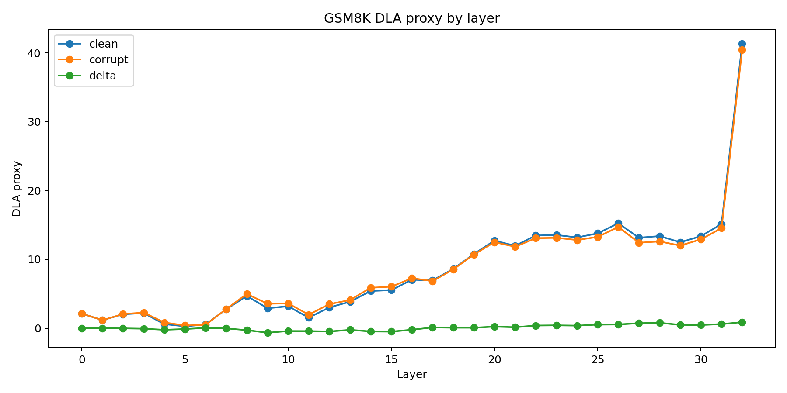 | 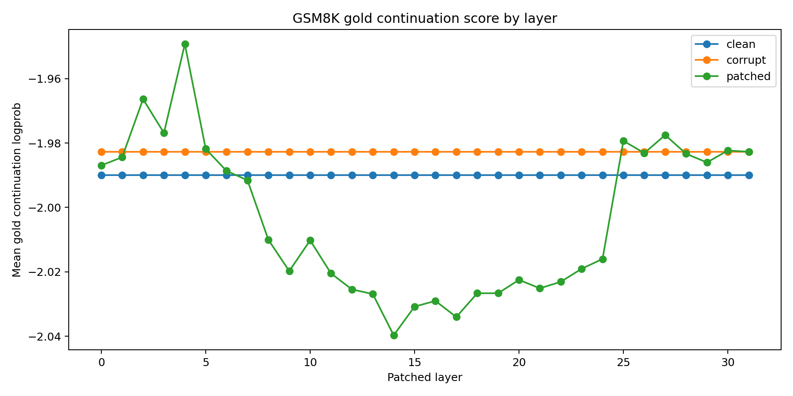 |
| 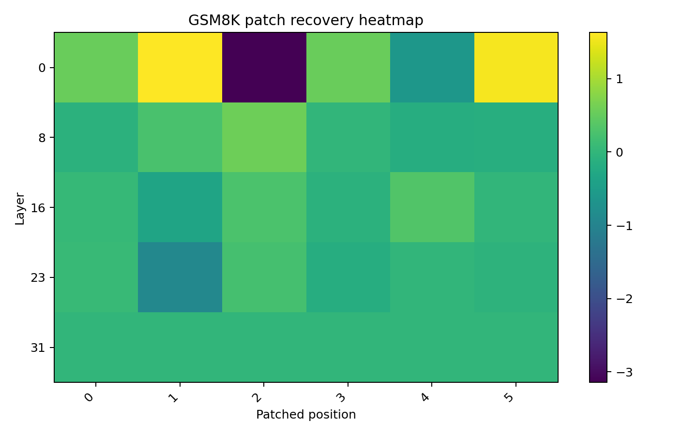 | 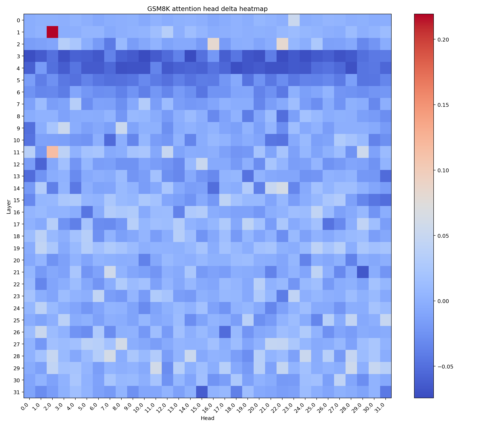 |

---

### StrategyQA Evaluation

| DLA & Position Heatmap | Recovery & Attention Heatmap |
| :---: | :---: |
| 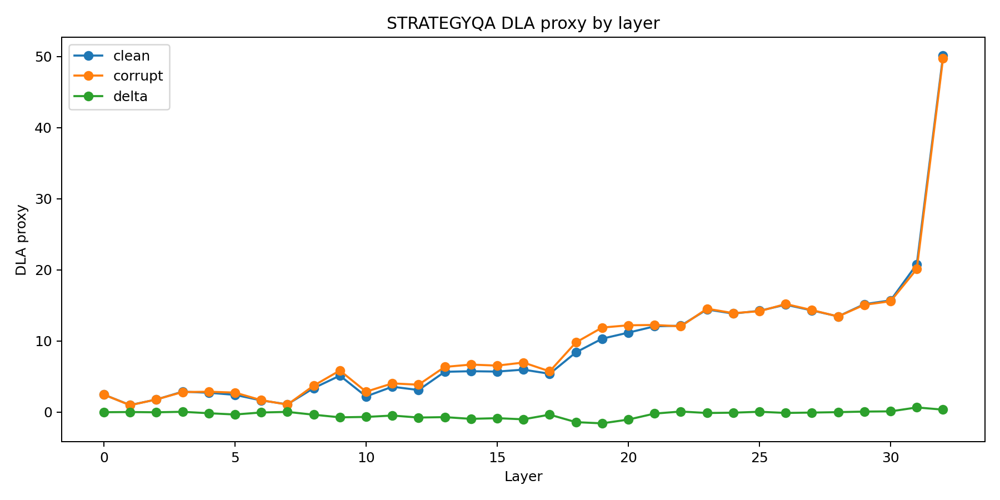 | 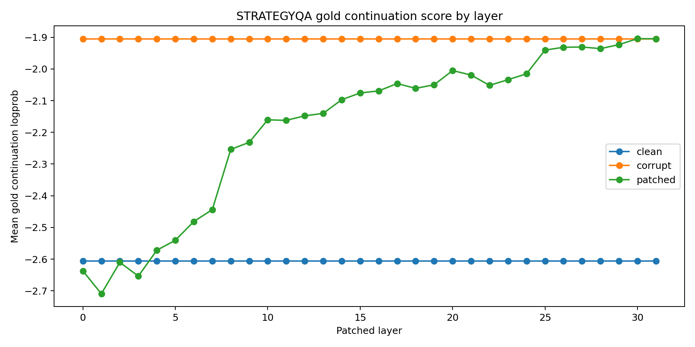 |
| 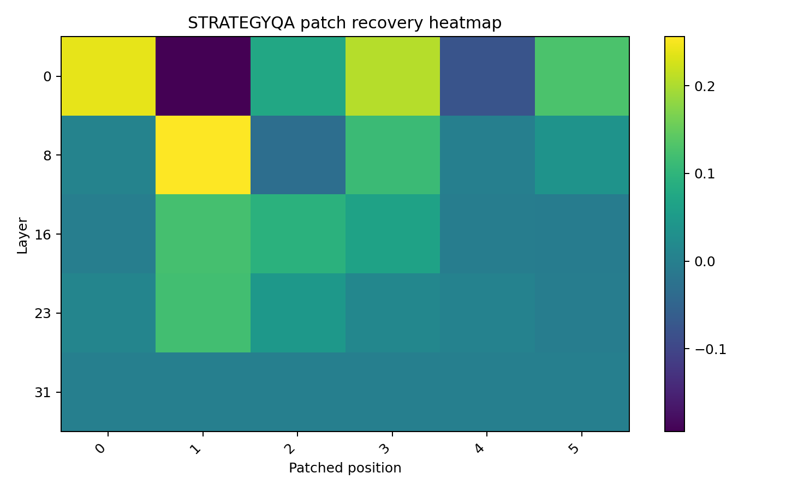 | 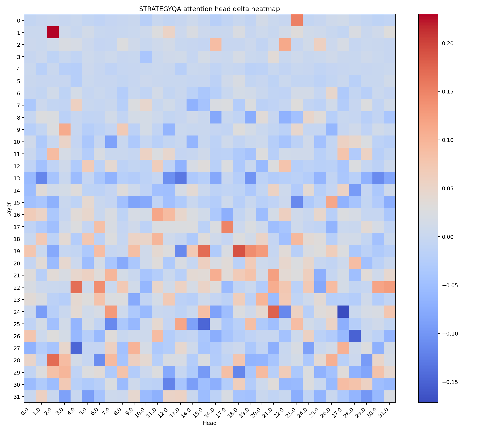 |

---

### MMLU Evaluation

| DLA & Position Heatmap | Recovery & Attention Heatmap |
| :---: | :---: |
| 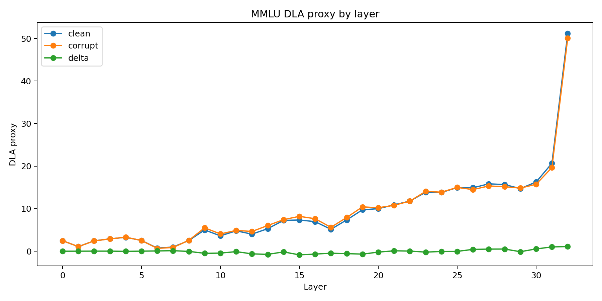 | 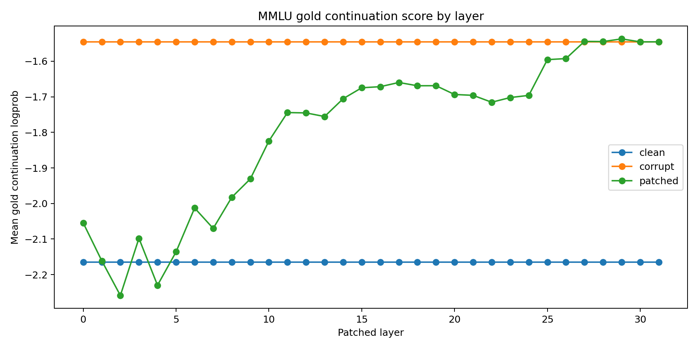 |
| 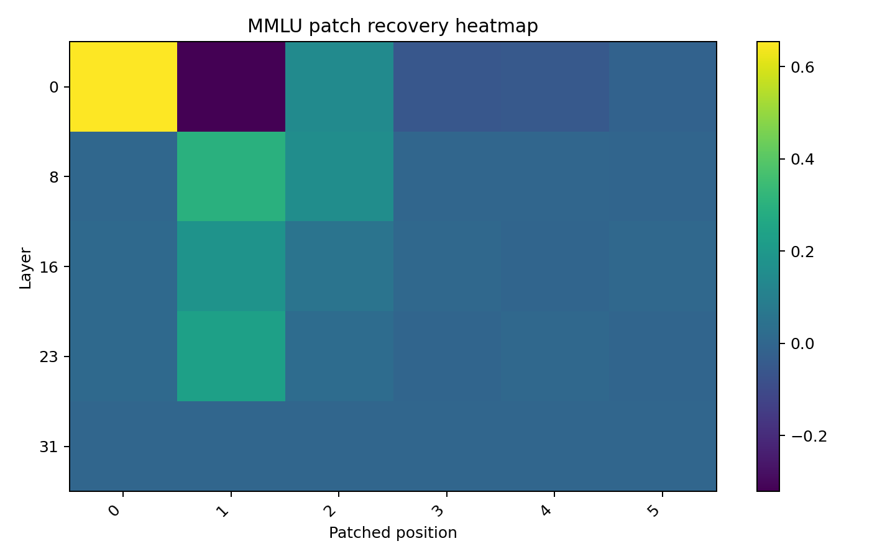 | 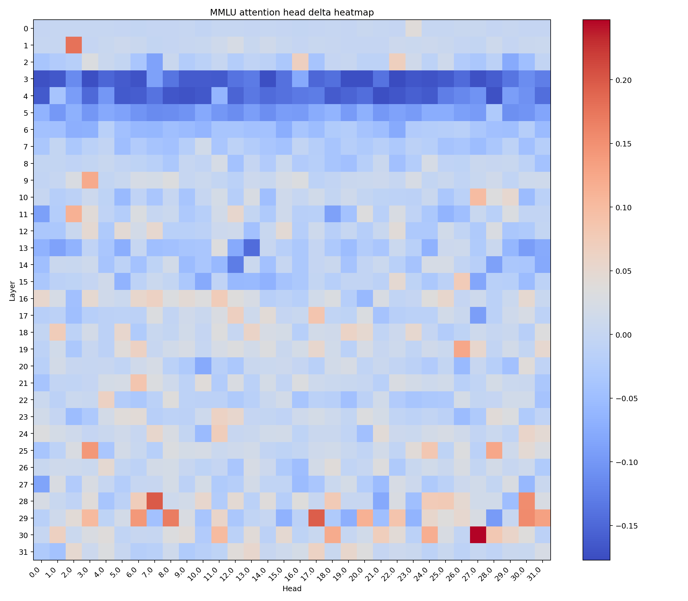 |

## Conclusion

Prompt syntax is not cosmetic.  
It changes the causal route through the network.  
That makes delimiter-aware training and answer-format rewards scientifically justified rather than arbitrary.