# MMLU permutation-consistency experiment

This experiment studies whether the model is truly choosing the right answer content, or merely leaning on a stable answer slot.

## Experimental setup

- Subjects:
  - abstract_algebra
  - college_mathematics
  - logical_fallacies
  - formal_logic
  - high_school_mathematics
- Questions per subject: 8
- Permutations per question: 12
- Delimiter prompt enabled: yes
- Plain-prompt baseline: no

## Main results

The anchored prompt variant achieved:
- original accuracy = 0.375
- permuted accuracy = 0.419
- consistency = 0.594
- content stability = 0.594
- raw bias = 0.408

Subject-level behavior varies a lot:
- logical_fallacies is the strongest subject in the sampled subset.
- high_school_mathematics and college_mathematics are weaker and more permutation-sensitive.
- abstract_algebra is intermediate.
- formal_logic is moderately stable but still not invariant.

## Interpretation

This experiment is important because it shows that MMLU behavior is not just “knowledge.”  
There is a measurable amount of:
- answer-position bias,
- option-slot dependence,
- and prompt-form sensitivity.

That means the model can be semantically right but still structurally fragile.

The most useful part of the experiment is not the raw accuracy alone.  
It is the difference between:
- original accuracy,
- permuted accuracy,
- and canonical consistency.

If the model stays stable under permutation, it is reasoning over the content.  
If it collapses into one favorite letter, it is relying on a shortcut.

This is why later stages introduced:
- explicit MCQ prompting,
- answer extraction discipline,
- and permutation-aware analysis.

## Phi-3 MMLU Permutation Consistency Experiment Results

### Global Metrics and Prompt Variant Analysis

| Accuracy & Bias | Consistency & Stability Analysis |
| :---: | :---: |
| 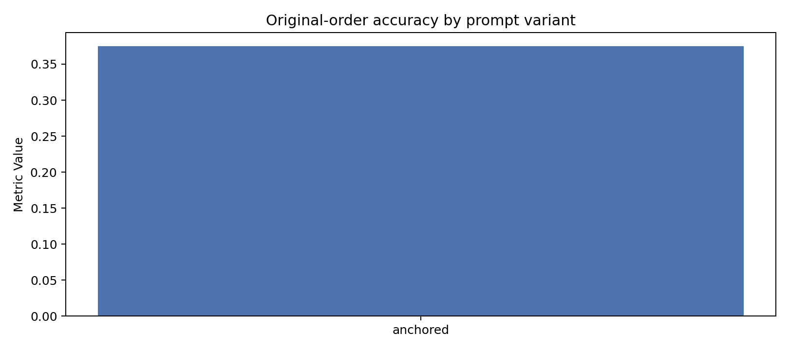 | 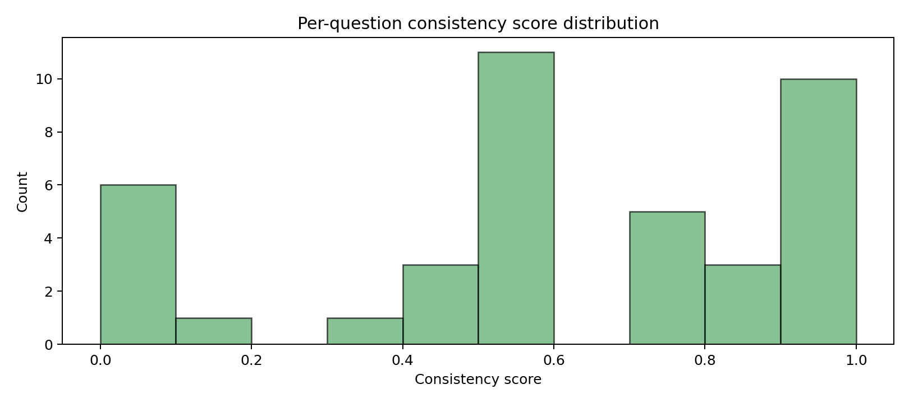 |
|  | 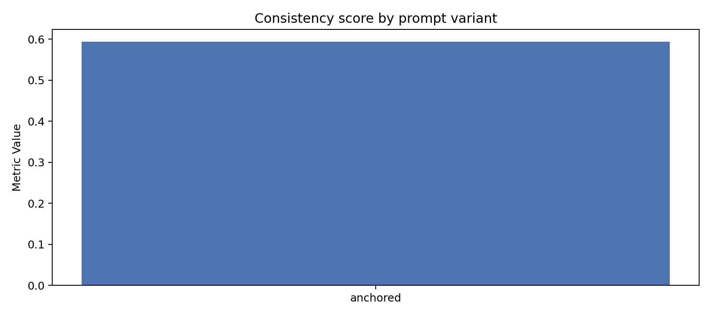 |
| 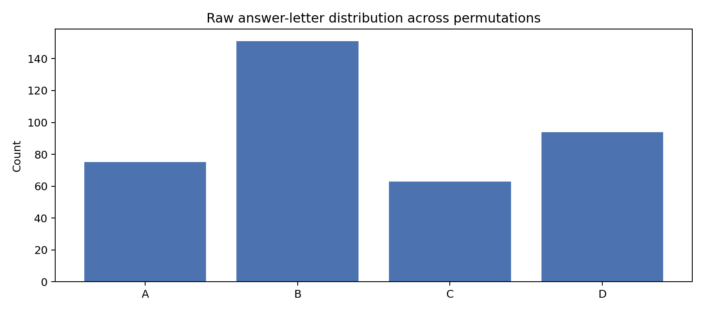 |  |
| 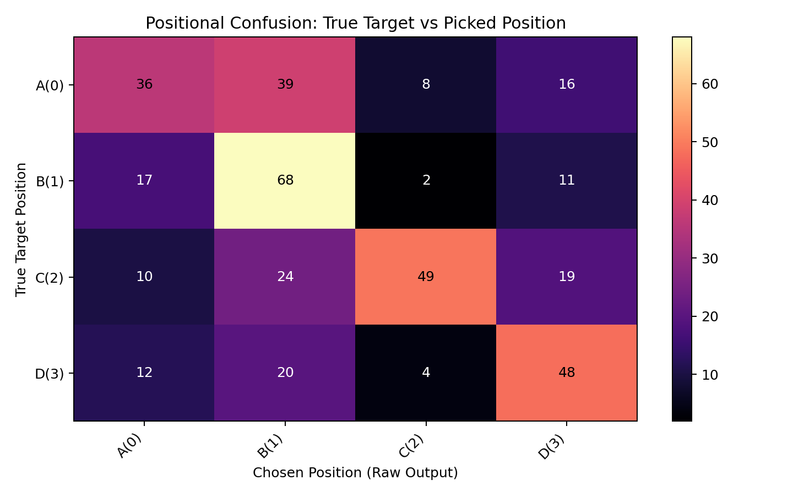 | 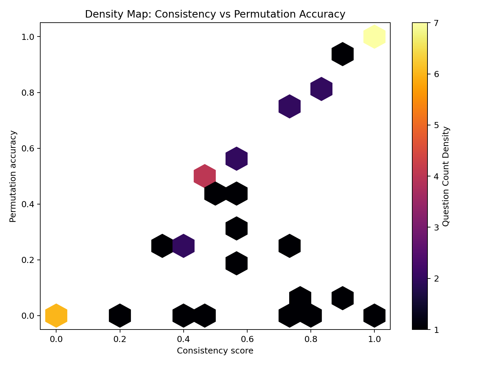 |

---

### Subject Evaluation Breakdowns

| | |
| :---: | :---: |
| 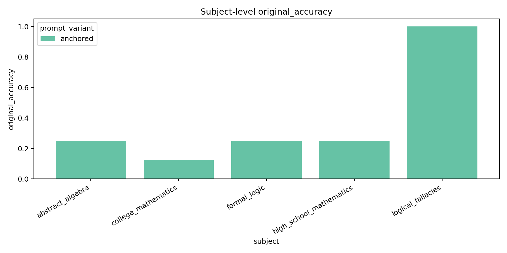 | 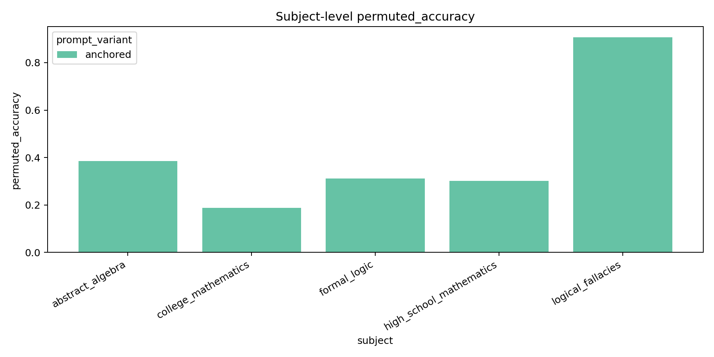 |
|  | 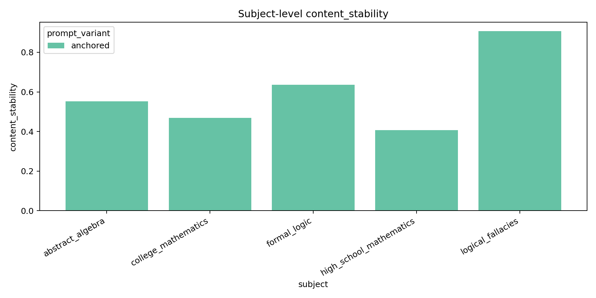 |

| Subject Raw Bias Fraction |
| :---: |
| 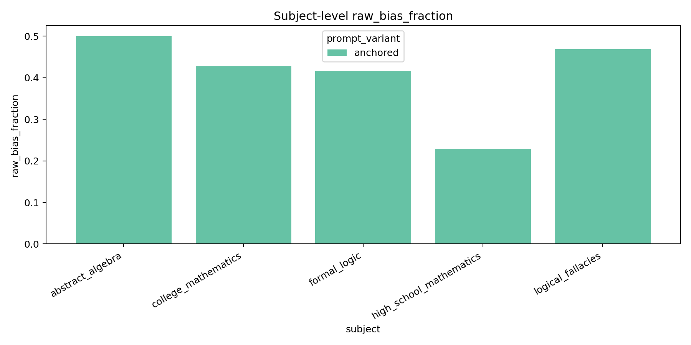 |

---

### Anchored Radar Comparison

| Radar Fingerprint |
| :---: |
| 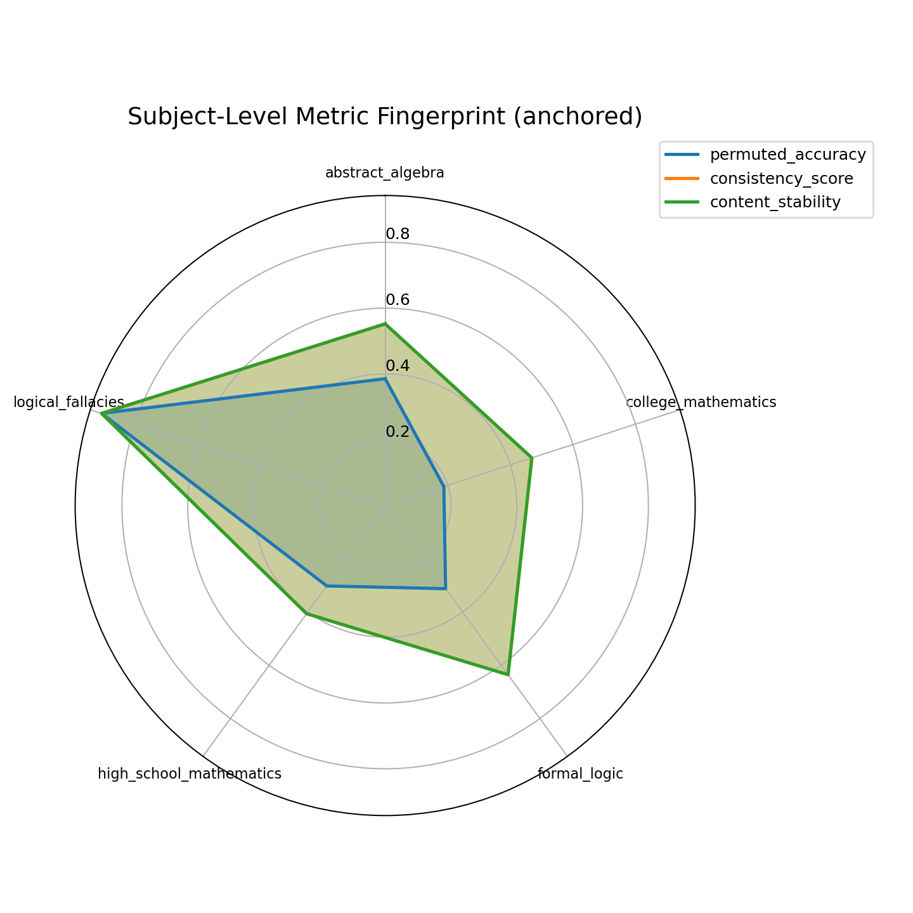 |

## Conclusion

MMLU is structurally sensitive to option order.  
That is exactly why later work had to include:
- permutation tests,
- answer-slot bias analysis,
- and answer-format rewards.