# Counterfactual prompt surgery atlas

This is the experiment that turns “prompt structure matters” into a causal map.

## Core question

What happens when we surgically change the prompt scaffold?
- `##`
- `Question:`
- `Answer:`
- `<think>`
- `<answer>`
- field order
- whitespace
- reasoning-heavy vs answer-first templates

The goal is not only to see whether accuracy changes.  
It is to see how the model’s internal logit flow changes when the prompt skeleton changes.

## Why this is important

The model’s behavior is clearly not invariant to surface form.  
This experiment shows that prompt edits can:
- increase or decrease confidence,
- change the DLA trajectory,
- alter answer entropy,
- and push the model into different answer basins.

That makes prompt surgery a true intervention, not just a cosmetic rewrite.

## Main findings

The effect is task-dependent:
- GSM8K can improve under a more rigid scaffold, but that improvement is tied to a tradeoff with format and confidence.
- StrategyQA can become more commit-ready with anchoring, but not always more accurate.
- MMLU can respond very strongly to scaffolding and answer-first structure.

One of the most important observations is the decoupling between:
- format compliance,
- and semantic accuracy.

A prompt can make the model better at following the form while making the actual answer worse.  
That is why the project later separates:
- correctness rewards,
- answer-format rewards,
- and routing rewards.

## Phi-3 Counterfactual Prompt Surgery Experiment Results

### GSM8K Prompt Surgery Analysis

#### System Dynamics and Latent Structures
| Phase Vector Field | Clustering Dendrogram |
| :---: | :---: |
| 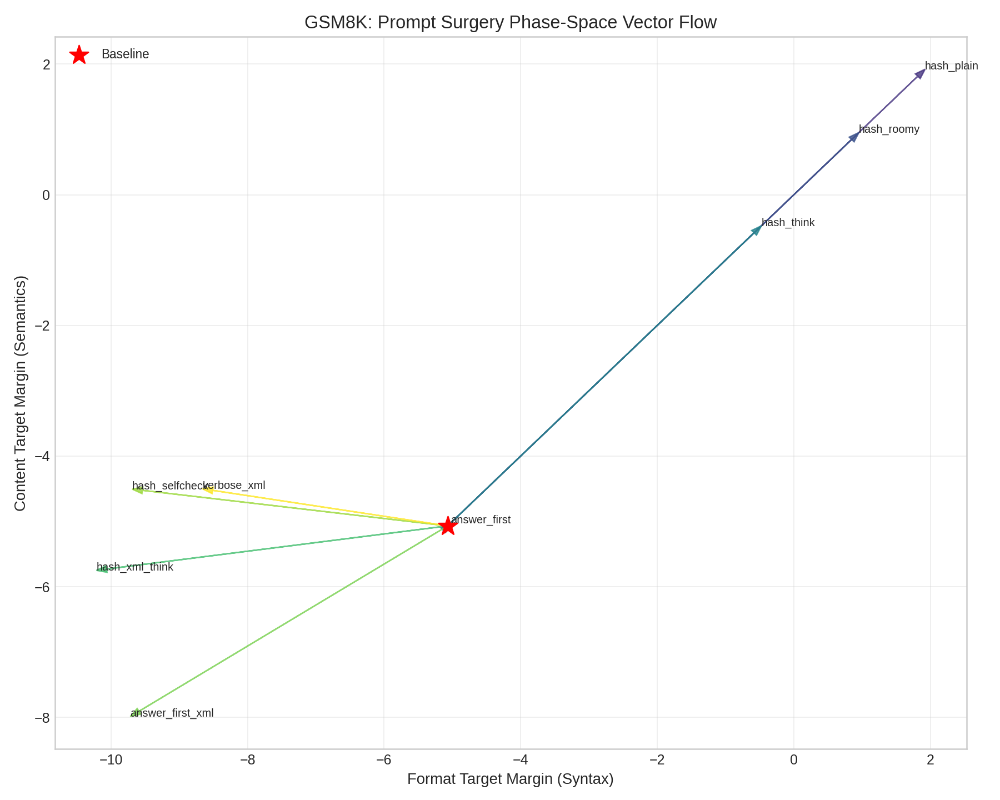 | 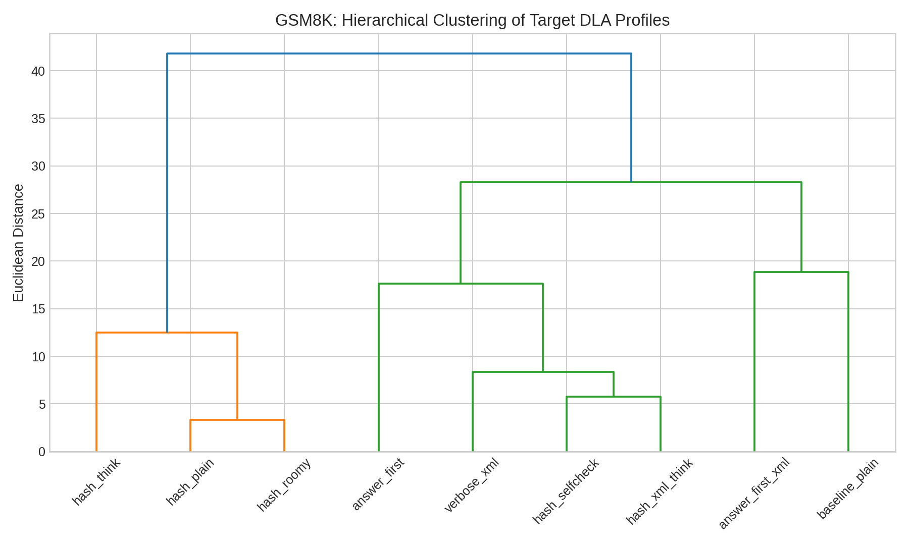 |

#### Layerwise Direct Logit Attribution (DLA)
| Top Topography 3D | Attribution Delta Heatmap |
| :---: | :---: |
| 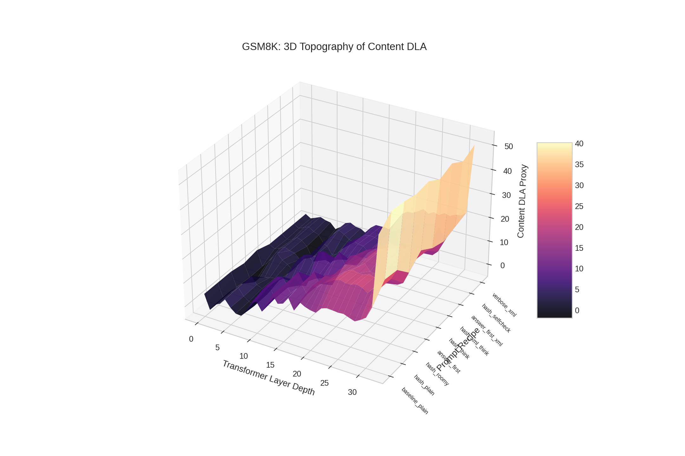 | 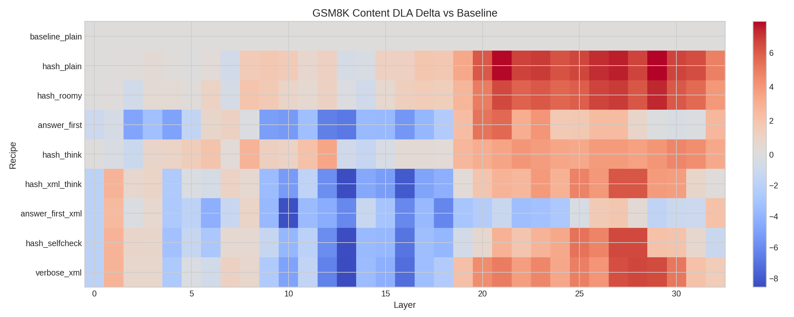 |

---

### StrategyQA Prompt Surgery Analysis

#### System Dynamics and Latent Structures
| Phase Vector Field | Clustering Dendrogram |
| :---: | :---: |
| 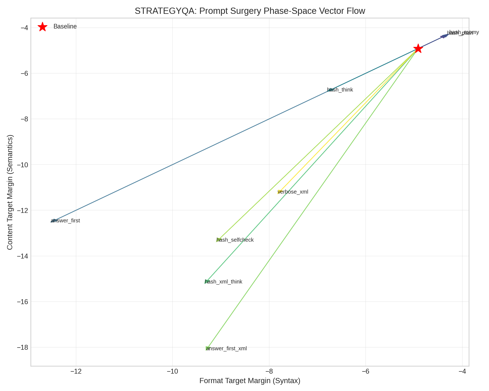 | 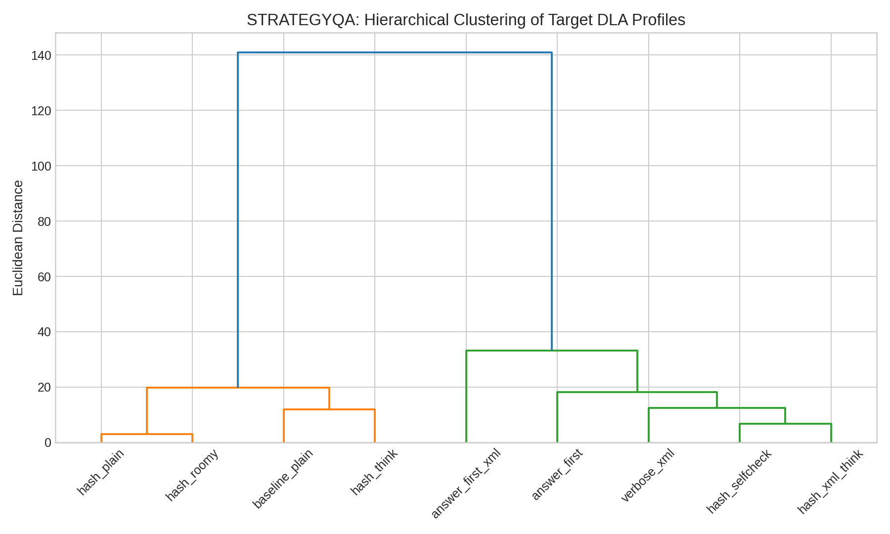 |

#### Layerwise Direct Logit Attribution (DLA)
| Top Topography 3D | Attribution Delta Heatmap |
| :---: | :---: |
| 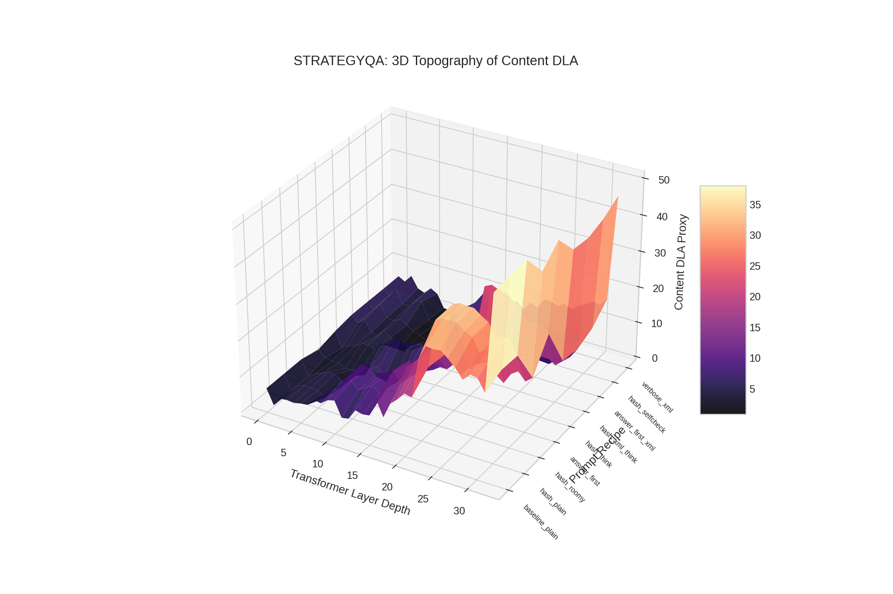 | 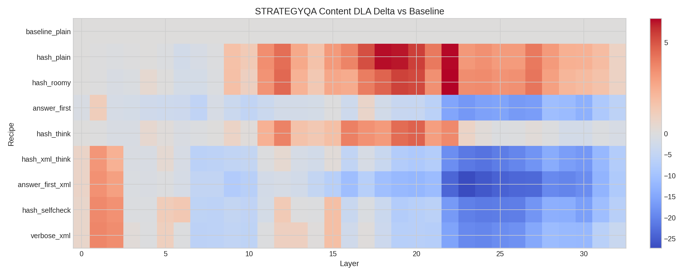 |

---

### MMLU Prompt Surgery Analysis

#### System Dynamics and Latent Structures
| Phase Vector Field | Clustering Dendrogram |
| :---: | :---: |
| 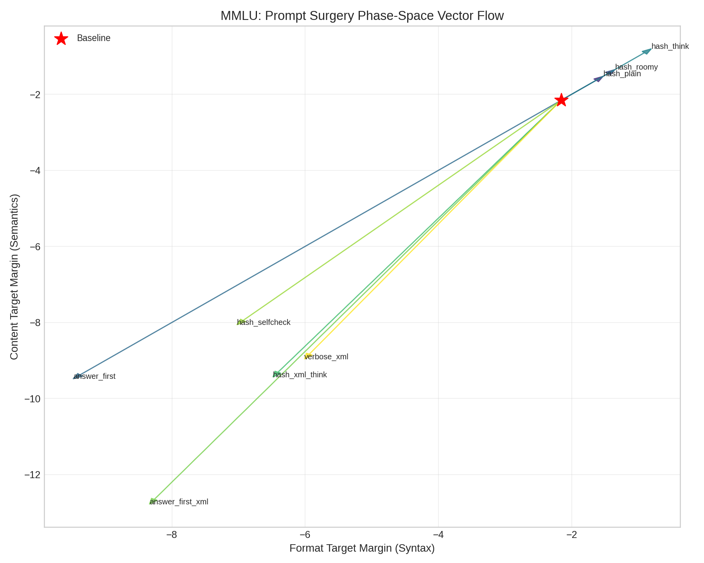 | 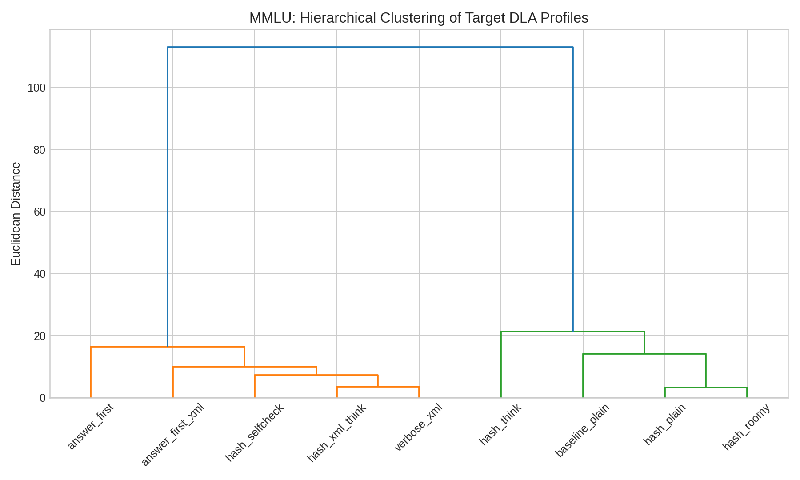 |

#### Layerwise Direct Logit Attribution (DLA)
| Top Topography 3D | Attribution Delta Heatmap |
| :---: | :---: |
| 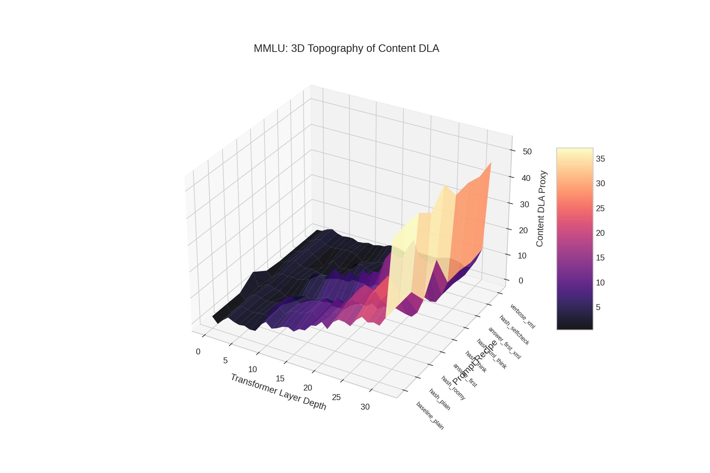 | 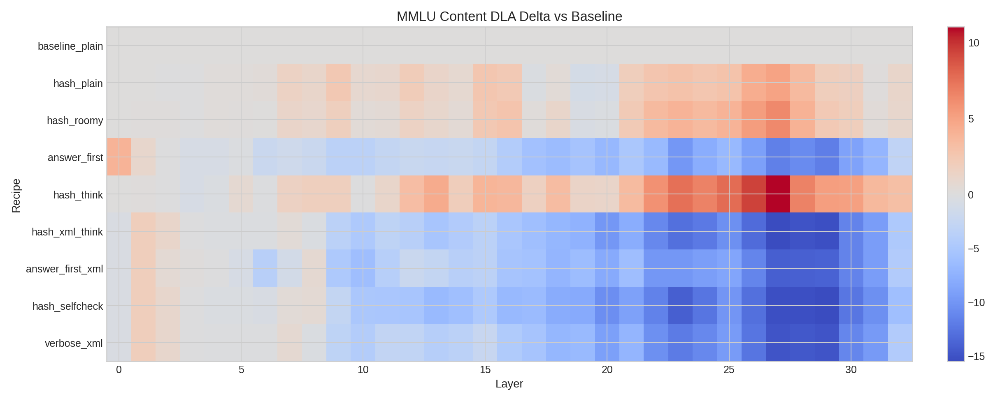 |

---

### Overall Variant Performance Atlas

| Comprehensive Model Variant Fingerprints |
| :---: |
| 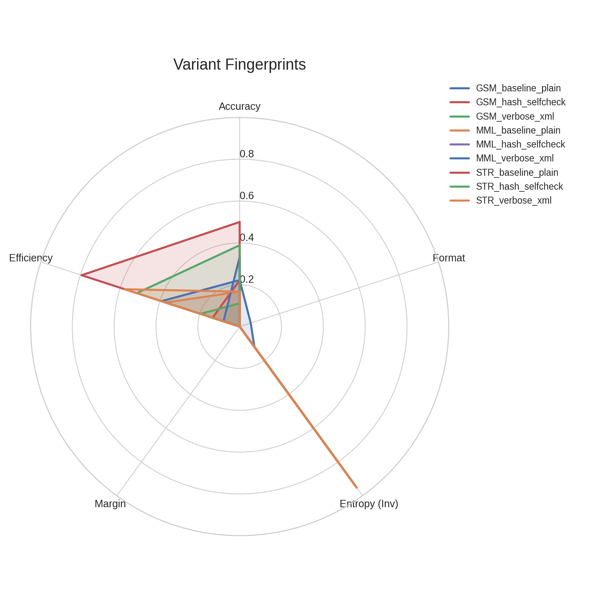 |

## Conclusion

Prompt surgery is causal.  
This is the mechanistic justification for format-aware rewards, answer anchoring, and XML-style scaffolds.