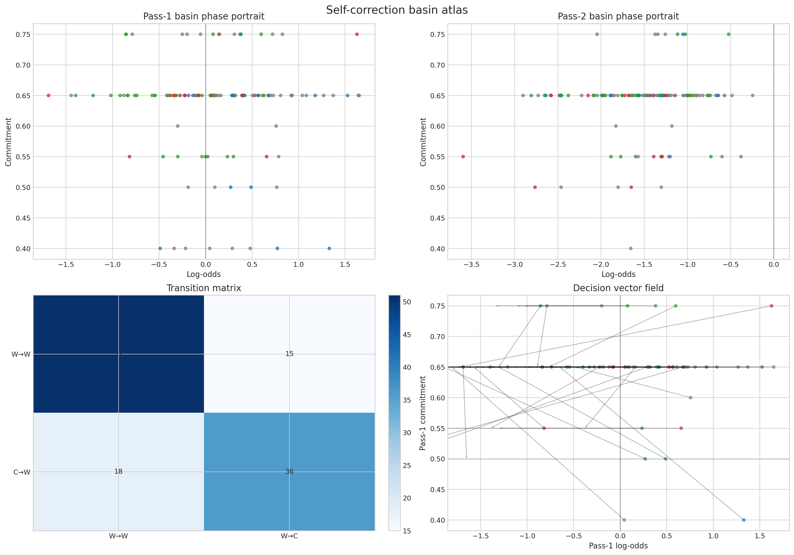
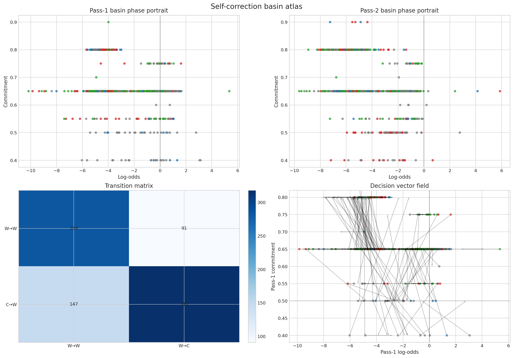
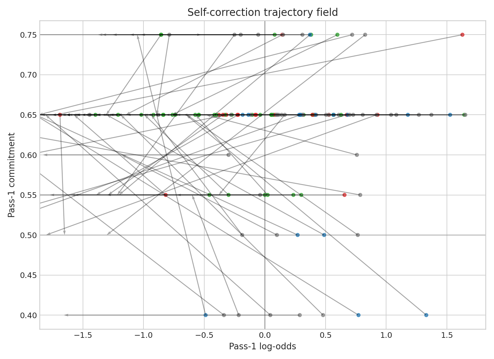
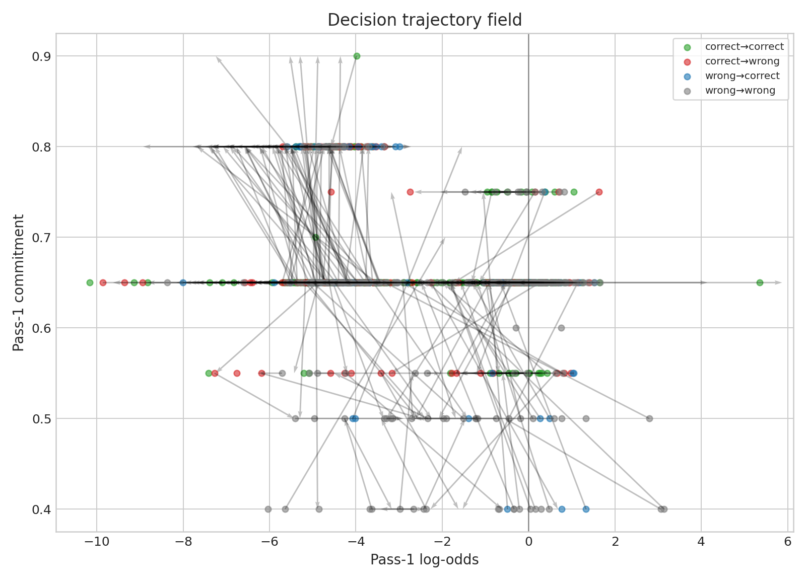
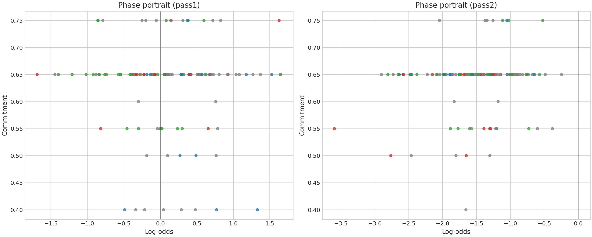
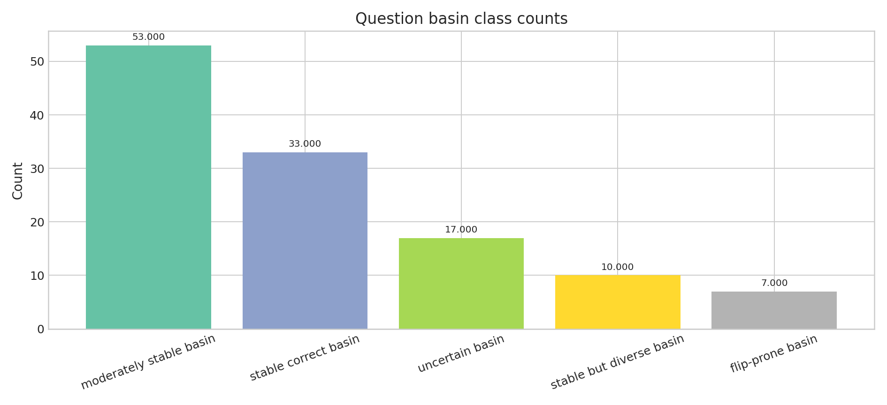
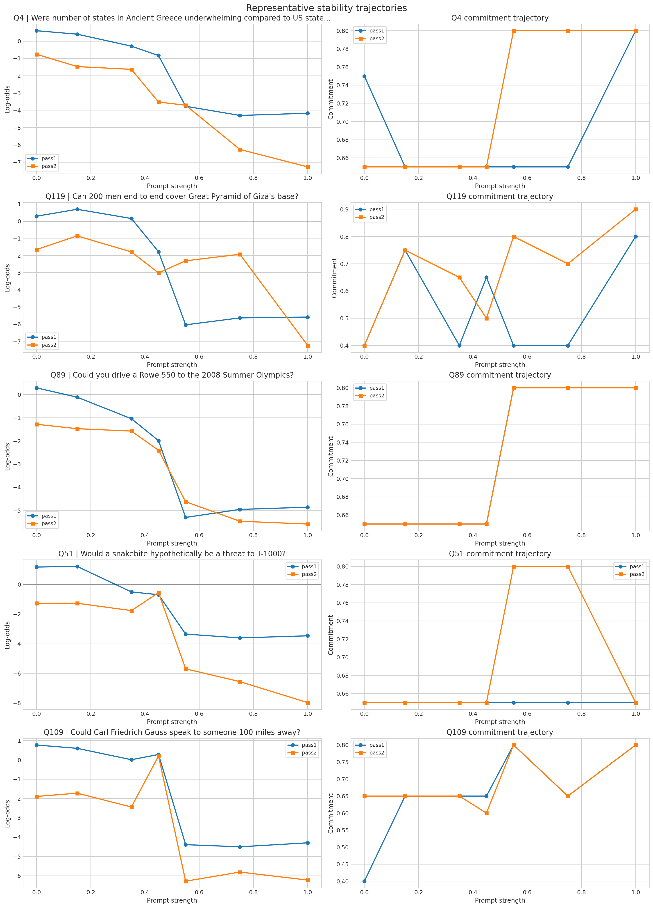

# StrategyQA self-correction basin atlas

This is the expanded self-correction experiment.  
It asks when a second pass helps, when it harms, and when it does nothing.

## Experimental setup

- Validation samples: 120
- Test samples: 120
- Prompt variants:
  - plain
  - anchored
  - anchored_reason
  - anchored_xml
  - anchored_selfcheck
  - answer_first
  - verbose
- Baseline variant: plain
- Deterministic decoding: yes

## Main findings

The baseline plain variant shows:
- pass-1 raw accuracy = 0.450
- pass-2 raw accuracy = 0.425
- pass-1 calibrated accuracy = 0.583
- pass-2 calibrated accuracy = 0.592
- improvement rate = 0.125
- regression rate = 0.150
- transition entropy = 1.831
- mean Q stability = 0.642
- mean Q drift = 0.303

The variant table shows that:
- anchored_reason has strong pass-1 accuracy,
- anchored_xml and anchored_selfcheck can improve some cases,
- answer_first is fragile and regresses often,
- verbose tends to increase drift.

The basin class counts show that the model is not uniformly stable:
- moderately stable basin: 53
- stable correct basin: 33
- uncertain basin: 17
- stable but diverse basin: 10
- flip-prone basin: 7

## Why it matters

Self-correction is not a free improvement layer.  
It is a conditional transition mechanism.

The basin atlas is valuable because it separates:
- genuinely recoverable mistakes,
- from already-correct answers that become unstable under review.

That directly motivates:
- verifier-guided second passes,
- self-critique only on selected cases,
- and conditional routing rather than universal self-correction.

## Figures to embed

## Phi-3 StrategyQA Self-Correction Basin Atlas Experiment Results

### Basin Atlas & Latent State Dynamics

#### Comprehensive Phase Space & Attractor Atlases

| Baseline Geometry Basin Atlas |
| :---: |
|  |

| All Variants Comparison Basin Atlas |
| :---: |
|  |

#### Trajectory Fields & High-Dimensional State Vectors

| Baseline Trajectory Tracking | Multi-Variant Dynamics Trajectory Field |
| :---: | :---: |
|  |  |
|  |  |

| Representative Path Trajectories (All Variants Overview) |
| :---: |
|  |

## Conclusion

Self-correction is useful only in the right basin.  
This experiment justifies selective routing and verifier-guided second passes.