# Phi-3 residual stream analysis — safe_fixed SFT run

This chapter records the first residual-stream comparison between the base model and the SFT model. It is deliberately conservative: the goal is to verify that the model’s internal geometry changes in a way that matches the benchmark gains.

## Main question

What changes inside the residual stream when the model is supervised-finetuned on the reasoning-style benchmark format?

## What this archive demonstrates

The answer is not that SFT “rewrites the model.”  
Instead, SFT changes how the model commits to the final answer.

The dashboards show a recurring pattern:
- the residual norm continues to grow strongly in later layers,
- the answer token becomes more dominant near the end,
- the logit lens becomes sharper,
- and the final PCA trajectory is easier to interpret than in the raw baseline.

This is the mechanistic counterpart to the benchmark story: the SFT model is not only more accurate; it is more decisive at the output boundary.

## Why this matters

The earlier diagnostic experiments already showed that:
- prompt syntax can redirect computation,
- answer extraction matters,
- calibration can recover hidden signal,
- and late-layer routing is the critical bottleneck.

This residual-stream chapter supports that interpretation directly. It shows that SFT improves the *interface* between reasoning and answer emission.

## Report-level takeaway

The safe_fixed run is useful because it provides a low-risk, reproducible SFT baseline for the TLens section. It establishes the main mechanistic claim used throughout the rest of the docs:
**SFT improves late answer routing and output discipline more reliably than it changes the early reasoning geometry.**

## Figures to embed

## Phi-3 Residual Stream Layerwise Dynamics (Base vs. SFT)

### Base Model Latent Dashboards

| GSM8K Stream Dashboards | StrategyQA Stream Dashboards |
| :---: | :---: |
| 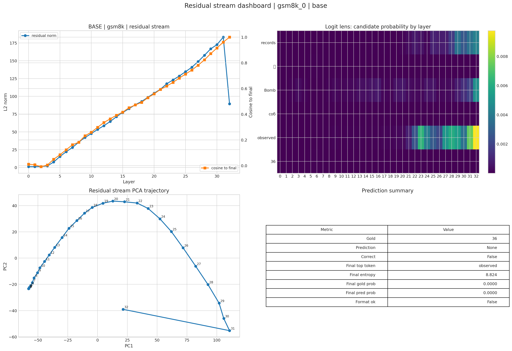 |  |
| 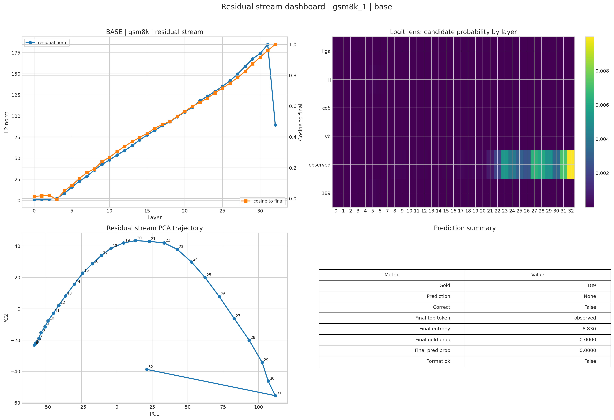 | 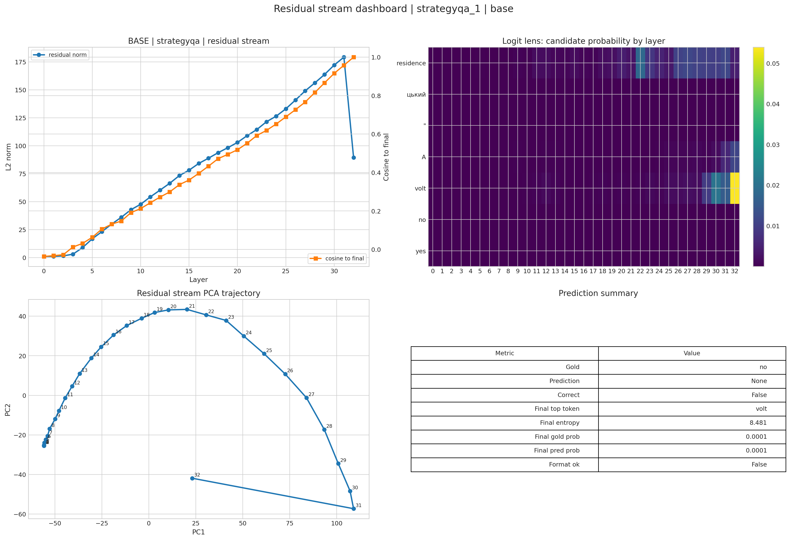 |

---

### SFT Model Latent Dashboards

| GSM8K Stream Dashboards | StrategyQA Stream Dashboards |
| :---: | :---: |
| 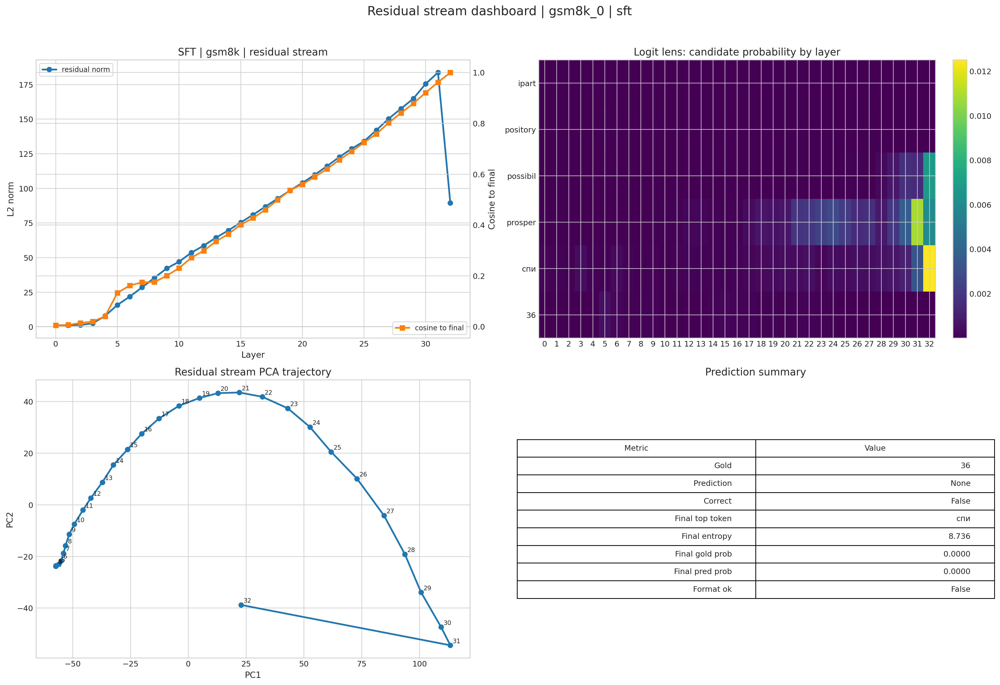 | 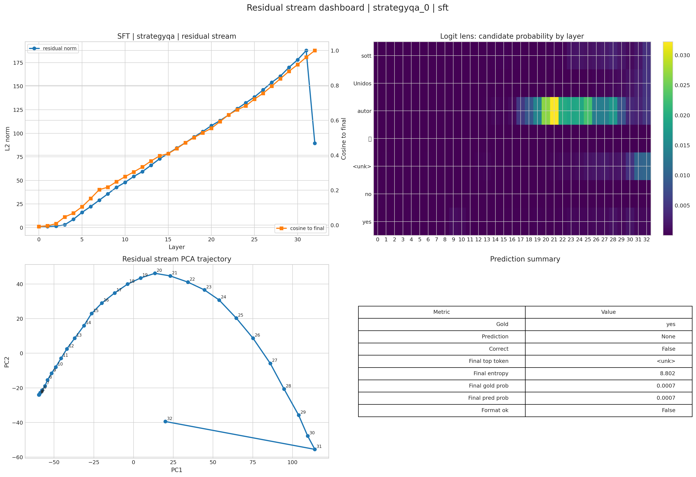 |
| 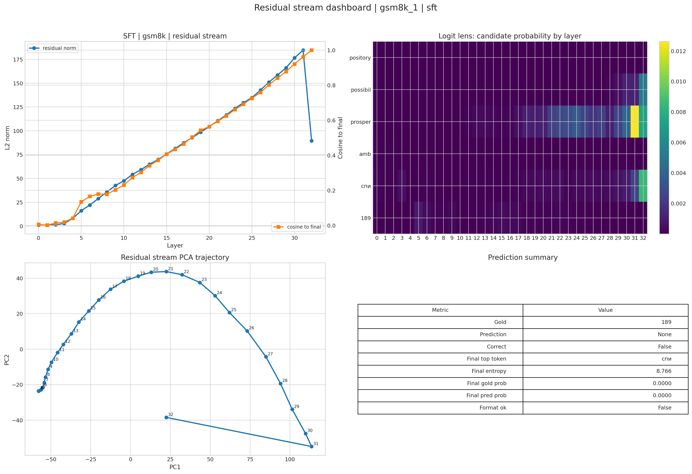 |  |

---

### Layerwise Inter-Model Comparison & Sequence Dynamics

#### GSM8K Sample 0 Direct Projections
| Logit Attribution Comparison | Hidden State Sequence Dynamics |
| :---: | :---: |
| 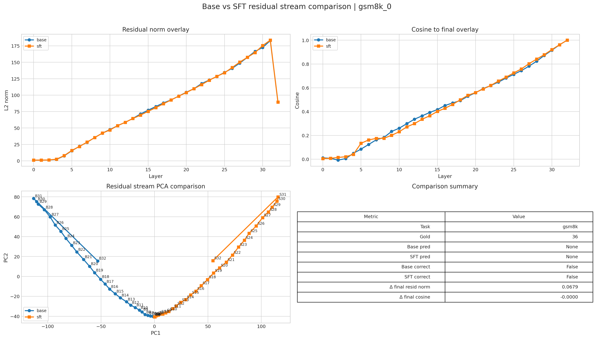 | 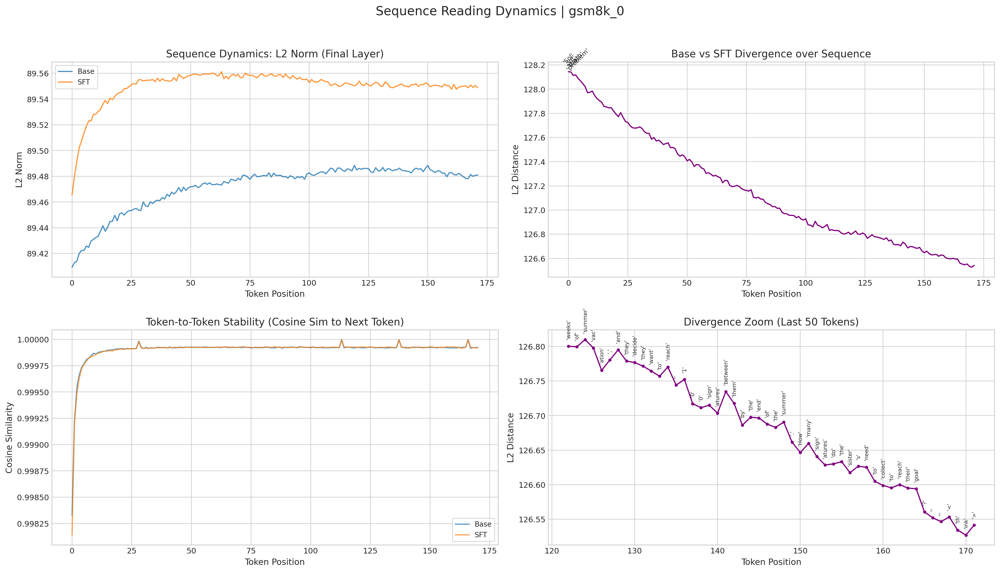 |

#### GSM8K Sample 1 Direct Projections
| Logit Attribution Comparison | Hidden State Sequence Dynamics |
| :---: | :---: |
| 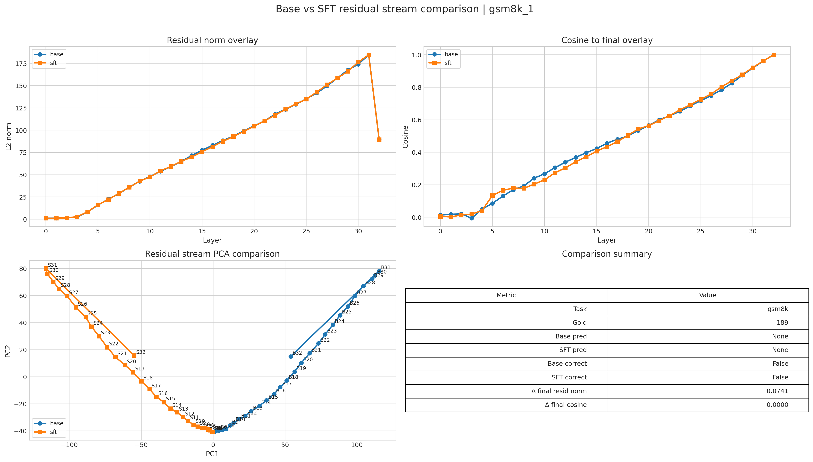 | 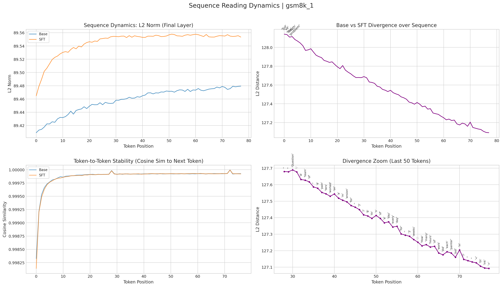 |

#### StrategyQA Sample 0 Direct Projections
| Logit Attribution Comparison | Hidden State Sequence Dynamics |
| :---: | :---: |
| 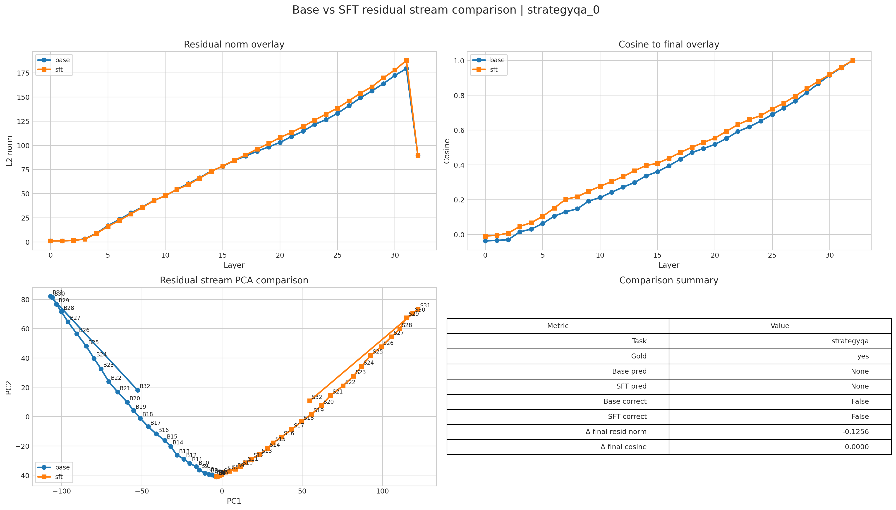 | 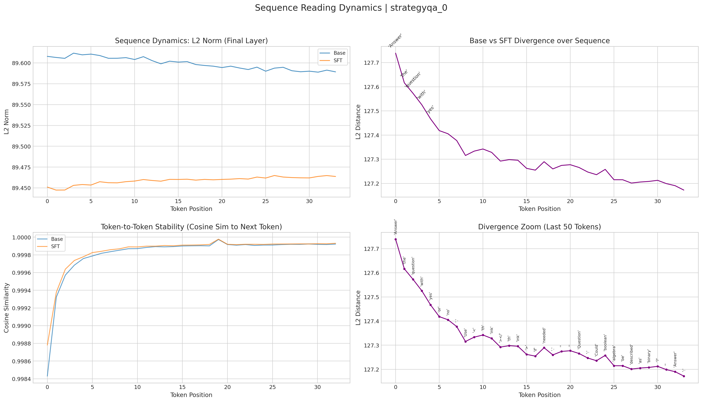 |

#### StrategyQA Sample 1 Direct Projections
| Logit Attribution Comparison | Hidden State Sequence Dynamics |
| :---: | :---: |
|  | 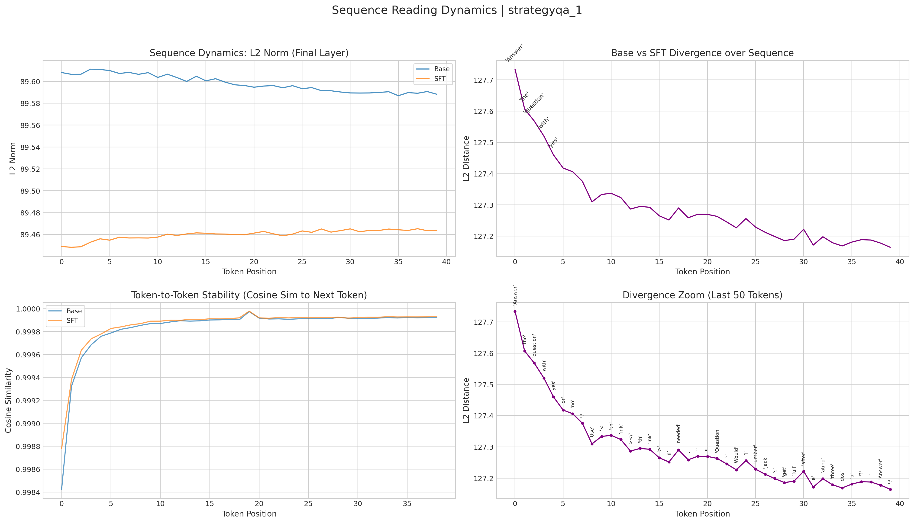 |

## Closing line

This archive is the “safe” residual-stream proof that the SFT checkpoint is not just better numerically; it is cleaner in the final decision pathway.